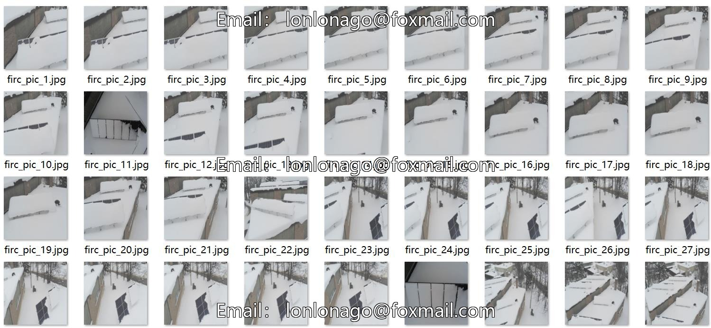
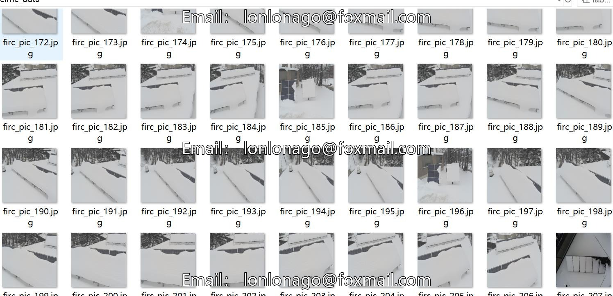
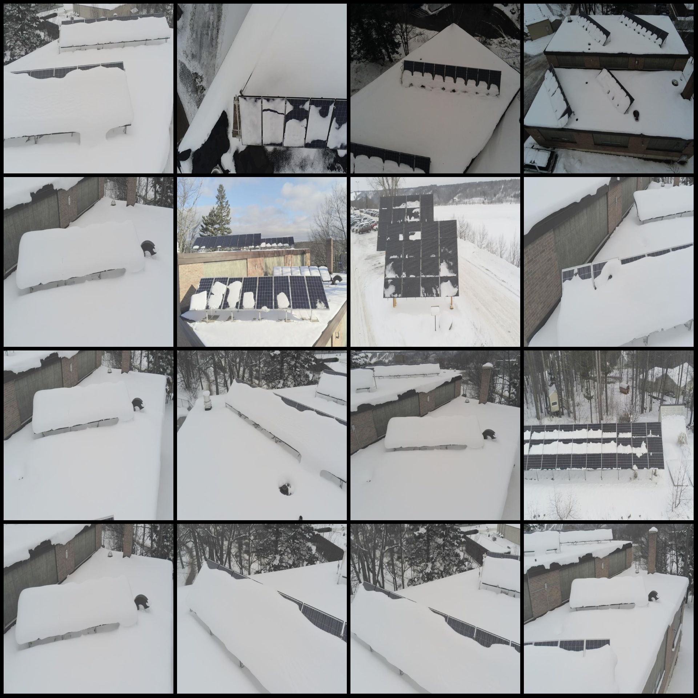
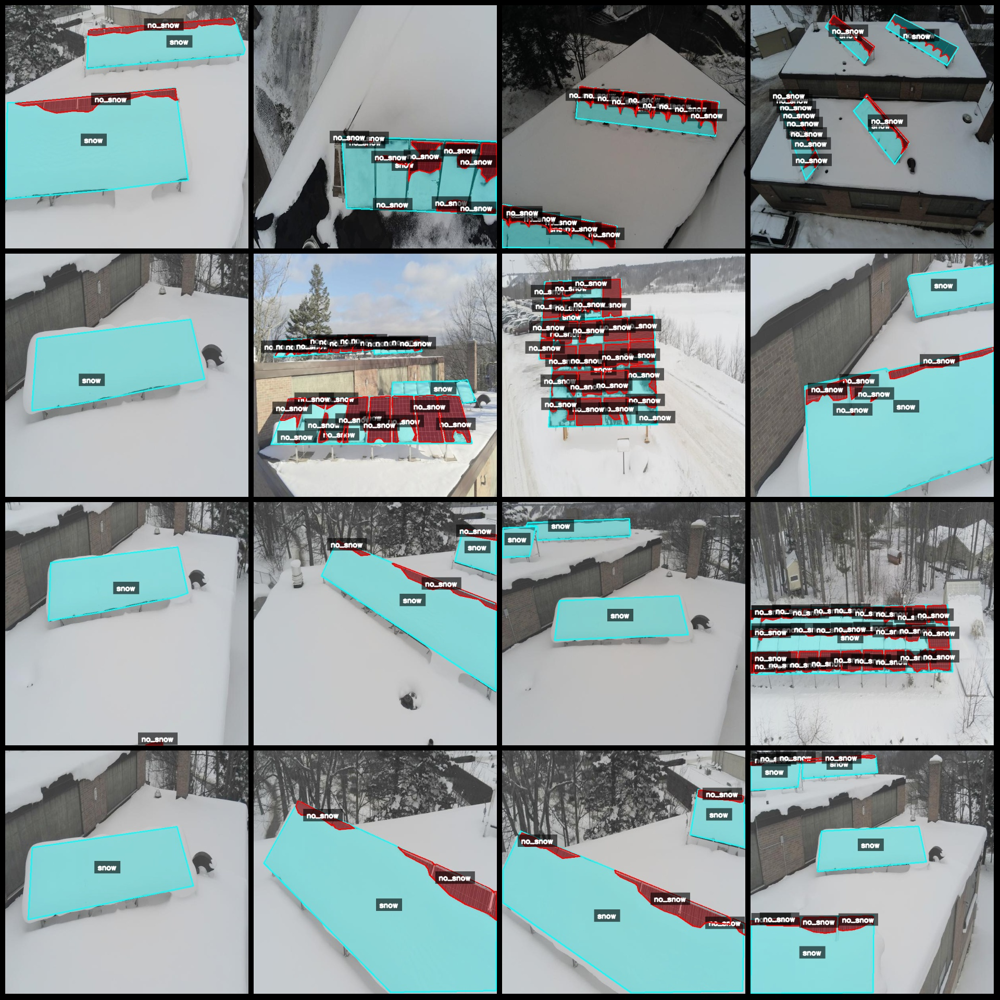
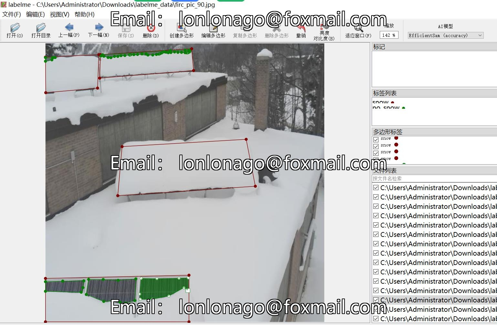

# Solar Photovoltaic Panel Snow Identification and Segmentation Dataset in LabelMe Format with 243 Images in 2 Classes

Dataset format: LabelMe format (excluding mask files, only containing JPG images and corresponding JSON files)
Number of images (JPG file count): 243
Number of annotations (JSON file count): 243
Number of annotation categories: 2
Annotation category names: ["No Snow", "Snow"]
Number of bounding boxes for each category:
No Snow count = 2639
Snow count = 567
Total number of bounding boxes: 3206
Using labelme tool version: 5.5.0
Image resolution: 608x608
Annotation rules: Polygons are drawn around the categories
Important note: The dataset can be edited using LabelMe, but the JSON dataset needs to be converted into a mask or Yolo format or COCO format for semantic segmentation or instance segmentation.
Special declaration: This dataset does not guarantee the accuracy of the trained models or weight files.
Sample image preview:
Annotation example:
Original image (randomly selected 16 images):
Annotation drawing result:
LabelMe editing image example:

## Images

Here is a pay link on Stripe ( https://buy.stripe.com/3cs8yP7sY87d0vu9AB ). Please contact me lonlonago@foxmail.com after funding $89, and I will send you a complete data files , thank you!

